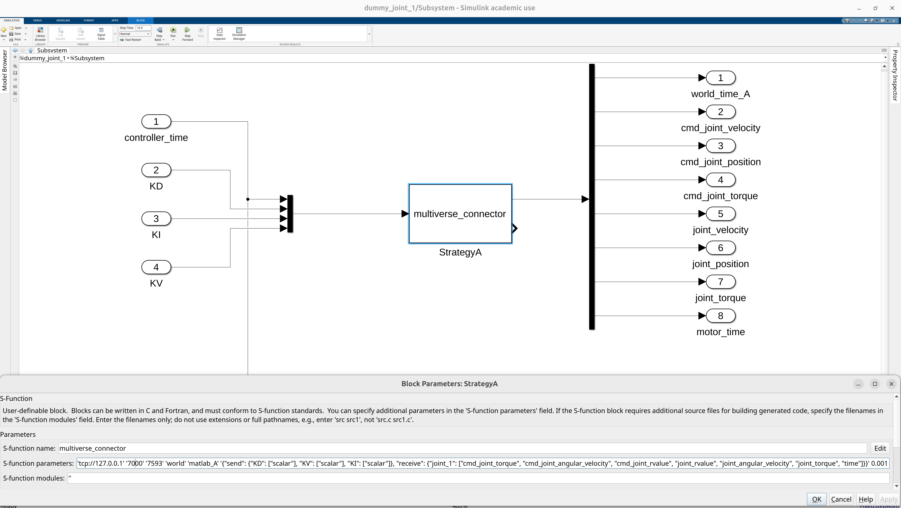

# Multiverse-Matlab-Connector

This repository provides everything you need to integrate [Multiverse](https://github.com/Multiverse-Framework/Multiverse) with **MATLAB Simulink** via a custom S-Function, and to test the integration effectively.

---

## 🧰 Prerequisites

- **MATLAB R2024b** or newer.
- MATLAB Add-On **MinGW-w64 Compiler** (on Windows, for building the MEX S-Function).
- On **Ubuntu**, system libraries must support `GLIBCXX_3.4.32` (e.g., GCC ≥ 11).

---

## 🚀 Using the S-Function in Simulink

### 1. Open MATLAB

- **Windows:** Launch `matlab.exe` as usual.
- **Ubuntu:** MATLAB uses an older `libstdc++.so.6` internally which may be incompatible with newer libraries. Use:

```bash
LD_PRELOAD=/usr/lib/x86_64-linux-gnu/libstdc++.so.6 matlab
```

This ensures the correct C++ standard library is loaded.

---

### 2. Change to the Binary Directory

In MATLAB, navigate to the directory containing the compiled S-Function:
```matlab
cd ./bin
```

---

### 3. Create an S-Function Block in Simulink

1. Open Simulink (via the HOME tab or `simulink` command).
2. Create a new model or open an existing one.
3. Add an **S-Function block**.
4. Configure the S-Function block:
   - **S-function name:**  
     ```
     multiverse_connector
     ```
     > This binary must be available in the current working directory (`./bin`).

   - **S-function parameters:**  
     ```
     '<host>' '<server_port>' '<client_port>' '<world_name>' '<simulation_name>' '<request_meta_data>'
     ```

#### Parameter Details:

- `<host>`: Address of the machine running Multiverse Server (e.g., `tcp://127.0.0.1`).
- `<server_port>`: The port Multiverse Server listens on.
- `<client_port>`: A **unique** port for this S-Function.
- `<world_name>`: The name of the shared simulation environment. All clients that use the same world_name will participate in the same virtual context and can exchange data with each other.
- `<simulation_name>`: A **unique** name for this S-Function.
- `<request_meta_data>`: A JSON string describing what data this client will **send** and **receive**.

#### JSON Format for `request_meta_data`

```json
{
  "send": {
    "object_1": ["position", "quaternion", "force", "torque"]
  },
  "receive": {
    "object_2": ["position", "quaternion"]
  }
}
```

- Object names (`object_1`, `object_2`, etc.) can be arbitrary.
- Attribute names must match those listed in `attribute_map_double` inside [`multiverse_connector.cpp`](./src/multiverse_connector.cpp).

#### Example:

1. Test S-Function

The Test S-Function is the one demonstrated in the provided test project [./test/dummy_joint_1.slx](./test/dummy_joint_1.slx):



2. Another S-Function

Here is a sample configuration string for an additional S-Function instance:

```matlab
'tcp://127.0.0.1' '7000' '4527' 'world' 'matlab' '{"send": {"object_1": ["position", "quaternion", "force", "torque"]}}'
```

This example connects to the local multiverse_server and sends state data for a single object.

---

### 4. Check Diagnostic Viewer

Go to **DEBUG → Diagnostics**, and open the **Diagnostic Viewer**.

Here, you’ll see:
- **Input port size**: based on the number of attributes defined under `"send"`.
- **Output port size**: based on the number of attributes defined under `"receive"`.

> The first input/output is always time (`clock` and `world_time`, respectively).

Example breakdown:
- `14` inputs:
  - 1 for clock (s)
  - 3 for force (N)
  - 3 for position (m)
  - 4 for quaternion
  - 3 for torque (Nm)
- `1` output:
  - world_time

> Input/output ordering is based on **alphabetical sort** of `object_name + attribute_name`.

---

### 6. You're Ready!

Once configured, your Simulink block can send/receive real-time data with the Multiverse Server. You can now connect it to other simulation blocks.

---

## 🛠️ Building the S-Function

If you make changes to [`multiverse_connector.cpp`](./src/multiverse_connector.cpp), rebuild it using the appropriate script:

- **Windows:**  
  Run `.\bin\compile_multiverse_connector_windows.m`

- **Linux/Ubuntu:**  
  Run `./bin/compile_multiverse_connector_linux.m`

> ⚠️ On Windows, you must install the **MinGW-w64 Compiler** add-on from MATLAB Add-On Explorer.

---

## 🧪 Testing the S-Function

To test the integration, you must execute the following steps in the correct order. Each component depends on the previous one being active and correctly configured. Skipping or reordering these steps may cause the system to hang or fail to connect.

### Step 1: Run the Multiverse Server

1. Clone the [Multiverse-ServerClient](https://github.com/Multiverse-Framework/Multiverse-ServerClient.git) repo:

```bash
git clone https://github.com/Multiverse-Framework/Multiverse-ServerClient.git
```

1. (Optional) Build the server via `make` 

2. Start the server:

- **Windows:** `.\bin\multiverse_server.exe`
- **Ubuntu:** `./bin/multiverse_server`

3. Get your server’s IP address — this will be used as the `<host>` by clients.

---

Sure! Here's the **updated section** from the testing instructions where we modify the Python command to explicitly pass the host using a command-line argument:

---

### Step 2 — Launch a Dummy Python Client

1. Clone the same repository if you haven’t already:
```bash
git clone https://github.com/Multiverse-Framework/Multiverse-ServerClient.git
```

2. Set the `PYTHONPATH` to include `Multiverse-ClientPy`, then run the test script with a specific host:

#### Windows:
```cmd
set PYTHONPATH=%PYTHONPATH%;<path_to>/Multiverse-ClientPy
python ./tests/dummy_joint_1.py --host=tcp://<host_ip>
```

#### Ubuntu:
```bash
export PYTHONPATH=$PYTHONPATH:<path_to>/Multiverse-ClientPy
python ./tests/dummy_joint_1.py --host=tcp://<host_ip>
```

> Replace `<host_ip>` with the IP address of the machine running the `multiverse_server` (default is `127.0.0.1`).

This launches a dummy client that:
- Sends joint commands and states data to the Multiverse Server
- Receives control gains (e.g., KP, KD, KI) from the Multiverse Server

---

### Step 3: Open the Simulink Test Project

1. Open MATLAB Simulink
2. Open the test model [./test/dummy_joint_1.slx](./test/dummy_joint_1.slx)
3. If the Multiverse Server is remote, open the `Subsystem` and update the S-Function's first parameter:  
   ```matlab
   'tcp://<host_ip>'
   ```

4. Click **Run**. The S-Function connects and exchanges data with the Multiverse.

> You can hit **Stop** and **Run** again freely. All clients sharing the same `world_name` will reset together.

---

## ⚠️ Important Guidelines

1. **Start the Multiverse Server first!**  
   Clients block until the Multiverse Server is available.

2. **Avoid running Simulink with an S-Function that specifies objects in the `receive` if those objects are not yet available on the server.**
   Doing so will cause the client to hang while waiting for the missing data.

3. **Use unique `simulation_name` and `client_port` for each client.**  
   Conflicts cause undefined behavior on the server.

4. **Always feed a valid clock signal to the S-Function.**  
   Supplying `0` or nothing will repeatedly reset other clients.

---

## ✅ Summary

With this connector, you can:
- Create tightly coupled simulations using Simulink and Multiverse
- Send/receive structured data
- Integrate Simulink and other clients in real time
